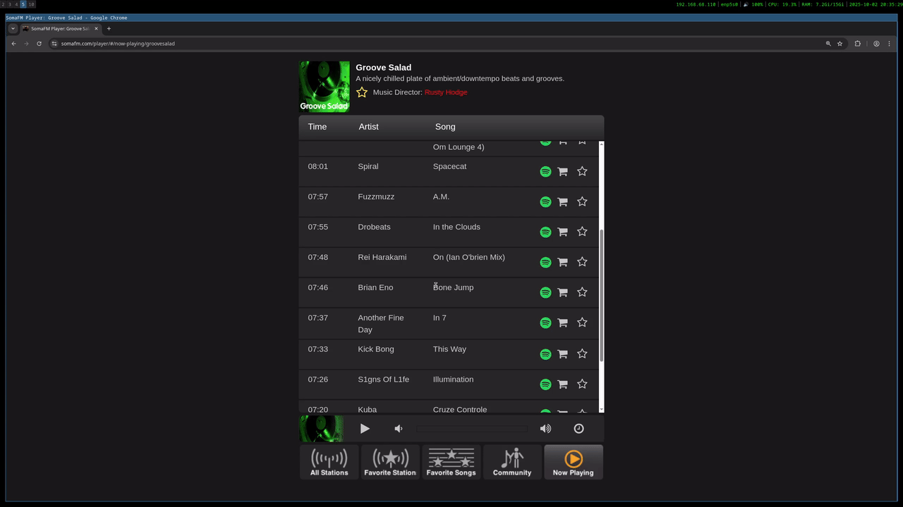

# WIP - Submitted this to Chrome, Firefox and Edge stores and have applied to get the spotify quota off developer mode. The extension links will be updated in coming days once everything is setup.

# SomaFM Spotify Track Adder

A browser extension that adds a button to SomaFM's web player to save tracks to a Spotify library.

#### Initial Authentication + Save


#### Standard Operation



## Installation

- [Google Chrome](tmp)
- [Mozilla Firefox](tmp)
- [Microsoft Edge](tmp)

## Privacy

See [Privacy Policy](PRIVACY_POLICY.md).

## Build / Run Locally

```bash
git clone https://github.com/jamisonrobey/somafm-track-adder.git
cd somafm-track-adder
pnpm i

# run dev server
pnpm dev
# pnpm dev:firefox

# build extension which you can load into your browser manually
pnpm build
# pnpm build:firefox

cd build/.output/
```
